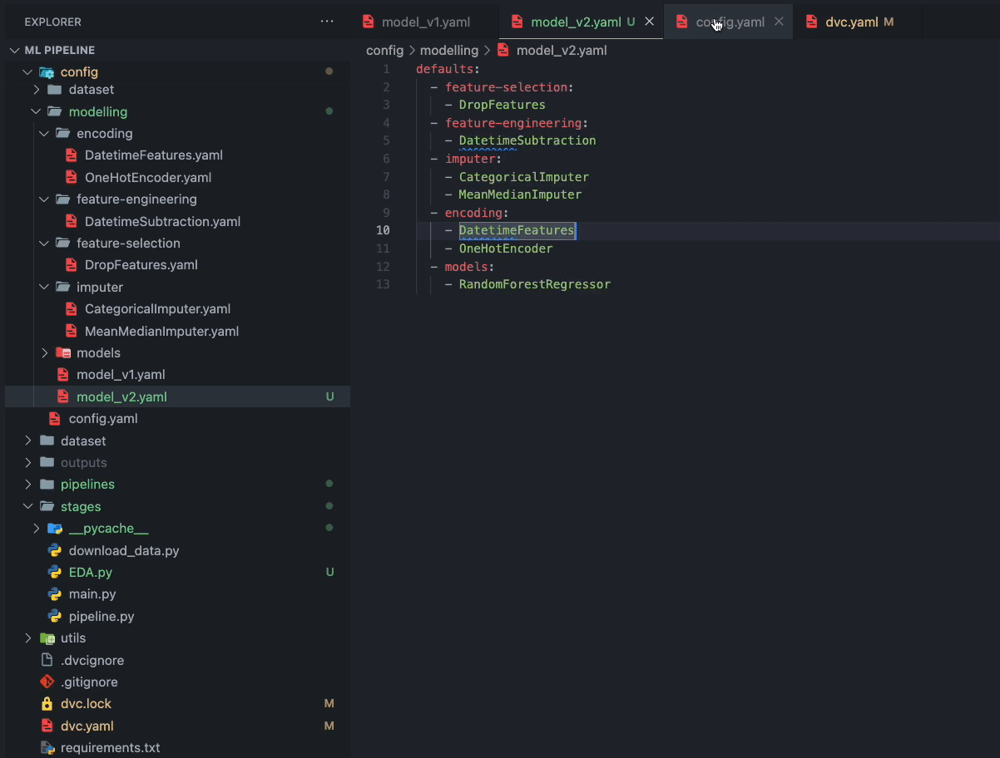

# Hydra-DVC Pipeline

## Overview

The **Hydra-DVC Pipeline** is a machine learning project setup that integrates:

- [**Hydra**](https://hydra.cc/docs/intro/) for flexible configuration management.
- [**DVC**](https://dvc.org/) for data version control.

This pipeline is designed to streamline machine learning experiments, enabling easy configuration tweaks and efficient dataset and model version control.

### Key Features:

- **Flexible Configuration**: Easily modify configurations without changing code.
- **Version Control**: Track and manage changes in datasets and models with DVC.
- **Modular Design**: Add or remove pipeline steps by adjusting configuration files.
- **Scikit-learn Compatibility**: Integrate any transformer or predictor that supports the scikit-learn API, including libraries like feature-engine and category-encoders.

### Workflow:

1. **Dataset Download**: Retrieve data from [NYC GOV](https://www.nyc.gov/site/tlc/about/raw-data.page).
2. **Pipeline Setup**:
   - Feature selection
   - Imputation
   - Feature engineering
   - Encoding
   - Model training to predict taxi driver tips
3. **DAG Creation**: Use DVC to create a Directed Acyclic Graph (DAG) to manage all stages from data downloading to model creation.
4. **Version Management**: Store datasets and models to track changes efficiently.

### Advantages:

- **Flexibility**: Modify pipeline steps without altering code.
- **Reproducibility**: Ensure experiments are reproducible with version control.
- **Easy Experimentation**: Quickly switch models and datasets with simple commands.

To switch models and datasets, you can run:
```bash
git checkout <branch_where_you_developed_old_model>
dvc checkout

```



## Installation

To set up the Hydra-DVC pipeline on your local machine, follow these steps:

1. **Clone the Repository**:
   ```bash
   git clone https://github.com/aymankhchman/Hydra-DVC-pipeline.git
   ```
2. **Navigate to the Project Directory**:
   ```bash
   cd Hydra-DVC-pipeline
   ```
3. **Install the Required Packages**:
   ```bash
   pip install -r requirements.txt
   ```

## Usage

To use the pipeline, set up your configuration files in the `config` directory according to your project's requirements. Adjust the pipeline stages by modifying the `dvc.yaml` file. Here’s how to run a basic pipeline:

1. **Execute the DVC Stages**:
   ```bash
   dvc repro
   ```
2. **Modify and Experiment**: Adjust the corresponding YAML files in the `config` directory and re-run the pipeline.

## Acknowledgements

- **Hydra** for powerful configuration management tools.
- **DVC** for making data version control manageable and efficient.
